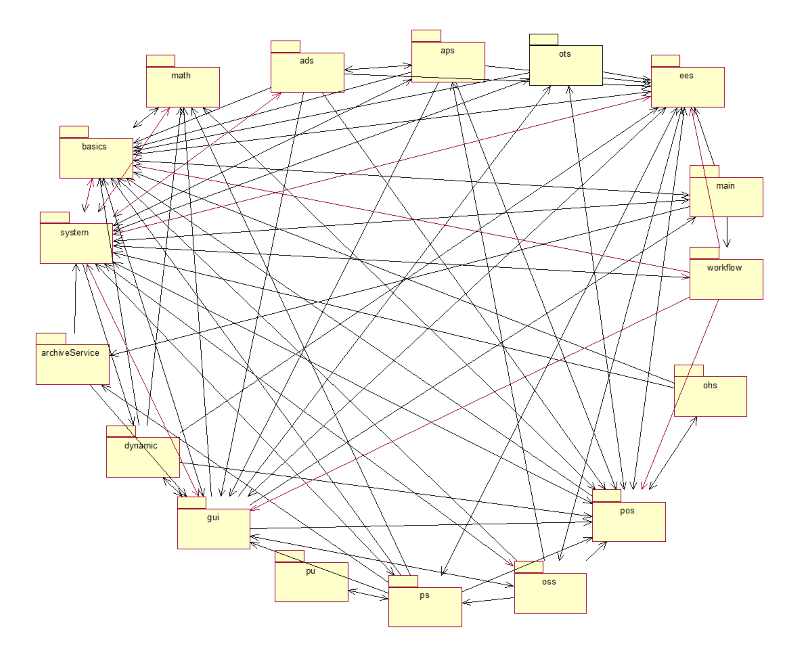
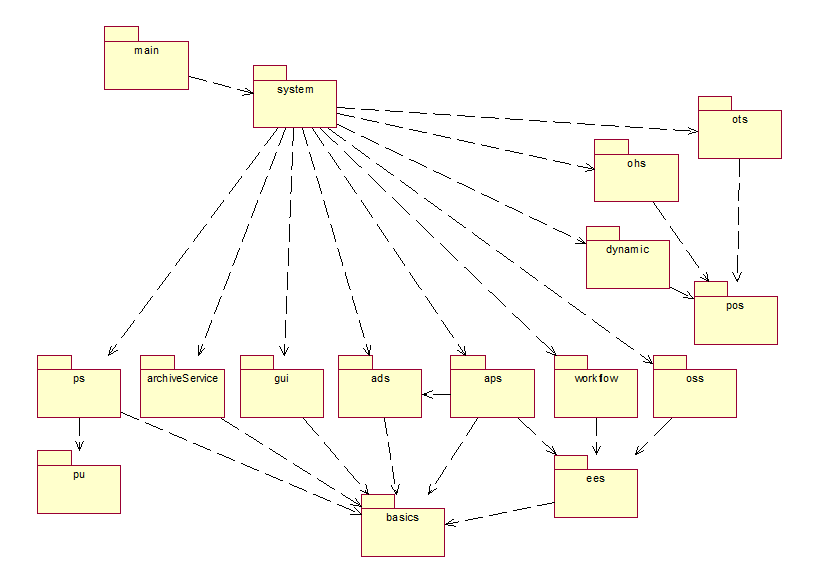

---

title: Einführung
permalink: /00-einfuehrung/
layout: page

---

# Objektorientiertes Programmieren

**(formerly known as _Programmieren 2_)**

## Bachelor Wirtschaftsinformatik

**Marcel Tilly**

Fakultät Informatik, Cloud Computing

---

# Organisatorisches

Moodle: [**Objektorientierte Programmierung - WIF SS 2019**](https://learning-campus.th-rosenheim.de/course/view.php?id=1174)
- Selbsteinschreibung 'wif-oop-ss19'

Mattermost: [**https://inf-mattermost.fh-rosenheim.de/wif-oop-ss19**](https://inf-mattermost.fh-rosenheim.de/wif-oop-ss19)

Übungen:

- Dienstags, 2./3./4. Stunde
- Raum: S1.31
- Tutor: Daniel Herzinger

---

# Organisatorisches

### Leistungsnachweis:

- __Benotete__ schriftliche Prüfung (90 Minuten)

- zusätzlich: **Coding Contest**

### Wichtige Termine:

-?. April: Prüfungsanmeldung im OSC
-13. Mai: Einführung in das Contestsystem (persönliche Anwesenheit erforderlich!)

---

# Organizatorisches

## Ablauf

- 2 SWS Vorlesung (Montags 11:45) in A3.13
- 2 SWS Übung (Dienstags, 3 Gruppen, mit Tutor) in S1.31

## Literatur

- [Offizielle Java Dokumentation](https://docs.oracle.com/javase/9/)
- Ullenboom, C: [Java ist auch eine Insel](https://www.amazon.de/Java-auch-eine-Insel-Java-Entwickler/dp/3836258692/), 2017. ([Online verfügbar!](http://openbook.galileocomputing.de/javainsel))
- Bäckmann, M: [Objektorientierte Programmierung für Dummies](https://www.amazon.de/Objektorientierte-Programmierung-Dummies-Marcus-B%C3%A4ckmann/dp/3826629841/), 2002. _Das Buch ist für C++, die Methodik aber identisch zu Java._
- Gamma, E et al.: [Design Patterns](https://www.amazon.com/Design-Patterns-Object-Oriented-Addison-Wesley-Professional-ebook/dp/B000SEIBB8), 1994. (Das Buch ist in englischer und deutscher Fassung in der Bibliothek vorhanden).

---

# Lernziele

- Vertiefung der objektorientierten Programmierung
	+ Vererbung
	+ Abstrakte Basisklassen
	+ Entwurfsmuster (Design Pattern)
- Abstrakte Datentypen
- Algorithmik:
	+ Sortieren
	+ Rekursion
	+ parallele Verarbeitung
- Grundlagen professioneller Softwareentwicklung
	+ Modellierung (Entwurf)
	+ Versionierung
	+ Testen

---

# Tips zu den Übungen

## Klären, _was_ eigentlich zu tun ist

Die Angaben sind auf Gitlab, lesen Sie die Readme sorgfältig durch.

## Festlegen, _wie_ die Aufgabe zu lösen ist

- Entwerfen Sie eine Lösungsskizze -- Papier und Stift sind Ihre Freunde!
- Beschreiben Sie Algorithmen in kleinen, ausführbaren Schritten
- Identifizieren Sie Spezialfälle

---

# Tips zu den Übungen

## Umsetzen des textuellen Algorithmus in Java

- Arbeiten Sie die Beschreibung Schritt für Schritt ab
- Fügen Sie Kommentare ein, wo der Code nicht selbstverständlich ist

## Testen

- Verwenden Sie JUnit um Ihr Programm mit vorgegebenen Eingaben zu testen.
- Erweitern Sie die Tests um weitere Ein- und Ausgaben.

--- 

# Motivation: "Bad design smells!"

---

# Bad Design: Wie kann das passieren?

**Problem**
- Zyklische Abhängigkeiten
- Keine klare Struktur

**Ursachen**
- Historisch gewachsen
- Viele Änderungen/ ohne Design
- adhoc
- Keine klaren Verantwortlichkeiten
- Unklarer Prozess

---

# Effekt

- Monolithisch
- Nicht wartbar
- Nicht wiederverwendbar
- Ineffizient
- Schwer zu testen
- Nicht verlässlich

---

# Good Design

---

# Why does it matter?

**Klare Struktur – klare Sprache**
- Eindeutige Abhängigkeiten
- modular

**Effekt**
- Definierte Verantwortlichkeiten
- Einfachere Wartung
- Einfachere Änderungen
- Effizienter
- Modular: Besser zu testen

---

# Anforderungen an Software

- **Korrektheit** (Correctness): Die Software erfüllt die Anforderungen
- **Einfache Handhabung** (Usability): Nutzer können das System problemlos nutzen
- **Robustheit** (Robustness): Software reagiert angemessen bei abweichenden Bedingungen
- **Erweiterbarkeit** (Extendable): beschreibt, wie leicht Software erweitert werden kann
- **Wiederverwendbarkeit** (Reuseable): Software (Elemente) kann für anderen Anwendungen wiederverwendet werden
- **Vereinbarkeit** (Composability): Wie leicht Software (Elemente) miteinander kombiniert werden können
- **Effizienz** (Efficiency): Möglichst wenig Anforderungen an die Hardware stellen

---

# Fragen?
