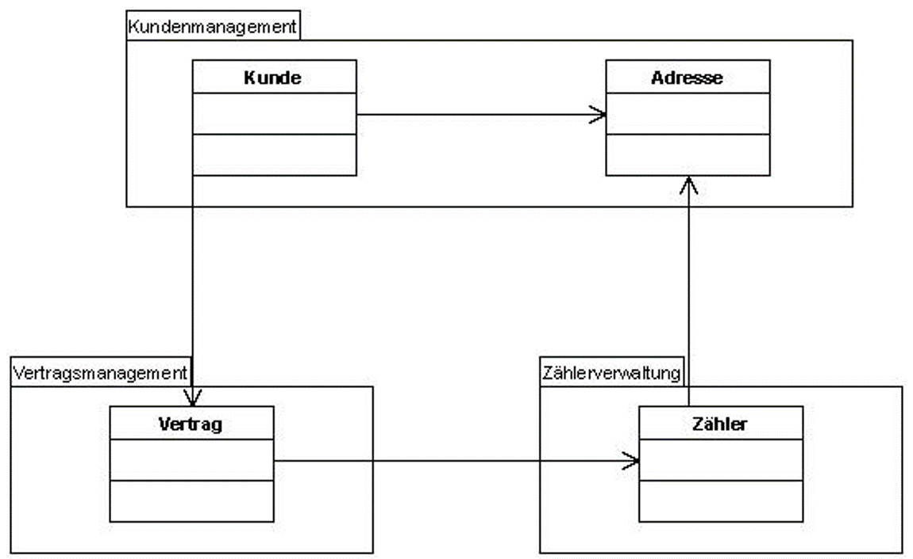
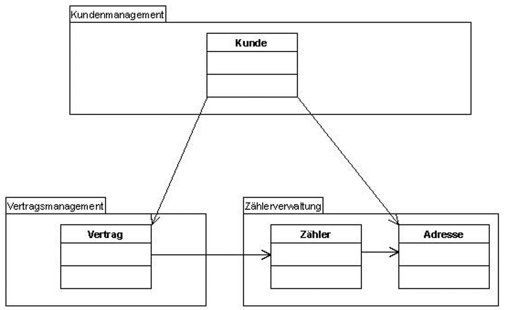

title: Einführung
permalink: /02-vorlesung/
layout: page

---

# Objektorientiertes Programmieren

Einführung in objektorientiertes Programmieren

## Bachelor Wirtschaftsinformatik

**Marcel Tilly**

Fakultät Informatik, Cloud Computing

---
Java ist natürlich nicht die erste objektorientierte Sprache (OO-Sprache), auch C++ war nicht die erste. Klassischerweise gelten Smalltalk und insbesondere Simula-67 aus dem Jahr 1967 als Stammväter aller OO-Sprachen. Die eingeführten Konzepte sind bis heute aktuell.

---
# OOP Prinzipen 

Die vier allgemein anerkannten Prinzipien der OOP:

- Abstraktion
- Kapselung
- Vererbung
- Polymorphie

---
# Warum OOP?

- Menschen nehmen die Welt in Objekten wahr
- Objektorientiertes Design mit prozeduralen Systemen ist schwierig (Programme, Unterprogramme,..)
- Objekte in Software haben 3 wichtige Eigentschaften:
      - Jedes Objekt hat eine **Identität** (bleibt erhalten während der Lebenszeit!)
      - Jedes Objekt hat einen **Zustand** (Bildet eine Einheit von Daten und Funktionaltät)
      - Jedes Objekt hat ein Verhalten

---
# Motivation: "Bad design smells!"

---

# Good Design

---

# Bad Design: Wie kann das passieren?

---

# Good Design

---

# Better Design

---

# Why does it matter?

**Klare Struktur – klare Sprache**
- Eindeutige Abhängigkeiten
- modular

**Effekt**
- Definierte Verantwortlichkeiten
- Einfachere Wartung
- Einfachere Änderungen
- Effizienter
- Modular: Besser zu testen

---

# Fragen?
